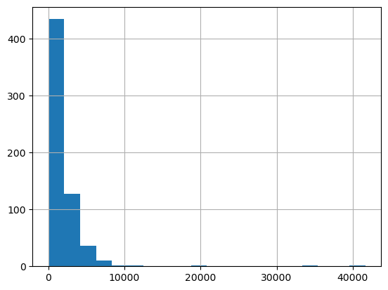

```python
import numpy as np
import pandas as pd
import matplotlib.pyplot as plt
%matplotlib inline

```


```python
dataset = pd.read_csv("Loan_Data.csv")
```


```python
dataset.head()
```


<div>
<style scoped>
    .dataframe tbody tr th:only-of-type {
        vertical-align: middle;
    }

    .dataframe tbody tr th {
        vertical-align: top;
    }

    .dataframe thead th {
        text-align: right;
    }
</style>
<table border="1" class="dataframe">
  <thead>
    <tr style="text-align: right;">
      <th></th>
      <th>Loan_ID</th>
      <th>Gender</th>
      <th>Married</th>
      <th>Dependents</th>
      <th>Education</th>
      <th>Self_Employed</th>
      <th>ApplicantIncome</th>
      <th>CoapplicantIncome</th>
      <th>LoanAmount</th>
      <th>Loan_Amount_Term</th>
      <th>Credit_History</th>
      <th>Property_Area</th>
      <th>Loan_Status</th>
    </tr>
  </thead>
  <tbody>
    <tr>
      <th>0</th>
      <td>LP001002</td>
      <td>Male</td>
      <td>No</td>
      <td>0</td>
      <td>Graduate</td>
      <td>No</td>
      <td>5849</td>
      <td>0.0</td>
      <td>NaN</td>
      <td>360.0</td>
      <td>1.0</td>
      <td>Urban</td>
      <td>Y</td>
    </tr>
    <tr>
      <th>1</th>
      <td>LP001003</td>
      <td>Male</td>
      <td>Yes</td>
      <td>1</td>
      <td>Graduate</td>
      <td>No</td>
      <td>4583</td>
      <td>1508.0</td>
      <td>128.0</td>
      <td>360.0</td>
      <td>1.0</td>
      <td>Rural</td>
      <td>N</td>
    </tr>
    <tr>
      <th>2</th>
      <td>LP001005</td>
      <td>Male</td>
      <td>Yes</td>
      <td>0</td>
      <td>Graduate</td>
      <td>Yes</td>
      <td>3000</td>
      <td>0.0</td>
      <td>66.0</td>
      <td>360.0</td>
      <td>1.0</td>
      <td>Urban</td>
      <td>Y</td>
    </tr>
    <tr>
      <th>3</th>
      <td>LP001006</td>
      <td>Male</td>
      <td>Yes</td>
      <td>0</td>
      <td>Not Graduate</td>
      <td>No</td>
      <td>2583</td>
      <td>2358.0</td>
      <td>120.0</td>
      <td>360.0</td>
      <td>1.0</td>
      <td>Urban</td>
      <td>Y</td>
    </tr>
    <tr>
      <th>4</th>
      <td>LP001008</td>
      <td>Male</td>
      <td>No</td>
      <td>0</td>
      <td>Graduate</td>
      <td>No</td>
      <td>6000</td>
      <td>0.0</td>
      <td>141.0</td>
      <td>360.0</td>
      <td>1.0</td>
      <td>Urban</td>
      <td>Y</td>
    </tr>
  </tbody>
</table>
</div>


```python
dataset.shape
```


    (614, 13)


```python
dataset.info()
```

    <class 'pandas.core.frame.DataFrame'>
    RangeIndex: 614 entries, 0 to 613
    Data columns (total 13 columns):
     #   Column             Non-Null Count  Dtype  
    ---  ------             --------------  -----  
     0   Loan_ID            614 non-null    object 
     1   Gender             601 non-null    object 
     2   Married            611 non-null    object 
     3   Dependents         599 non-null    object 
     4   Education          614 non-null    object 
     5   Self_Employed      582 non-null    object 
     6   ApplicantIncome    614 non-null    int64  
     7   CoapplicantIncome  614 non-null    float64
     8   LoanAmount         592 non-null    float64
     9   Loan_Amount_Term   600 non-null    float64
     10  Credit_History     564 non-null    float64
     11  Property_Area      614 non-null    object 
     12  Loan_Status        614 non-null    object 
    dtypes: float64(4), int64(1), object(8)
    memory usage: 62.5+ KB
    


```python
dataset.describe()
```


<div>
<style scoped>
    .dataframe tbody tr th:only-of-type {
        vertical-align: middle;
    }

    .dataframe tbody tr th {
        vertical-align: top;
    }

    .dataframe thead th {
        text-align: right;
    }
</style>
<table border="1" class="dataframe">
  <thead>
    <tr style="text-align: right;">
      <th></th>
      <th>ApplicantIncome</th>
      <th>CoapplicantIncome</th>
      <th>LoanAmount</th>
      <th>Loan_Amount_Term</th>
      <th>Credit_History</th>
    </tr>
  </thead>
  <tbody>
    <tr>
      <th>count</th>
      <td>614.000000</td>
      <td>614.000000</td>
      <td>592.000000</td>
      <td>600.00000</td>
      <td>564.000000</td>
    </tr>
    <tr>
      <th>mean</th>
      <td>5403.459283</td>
      <td>1621.245798</td>
      <td>146.412162</td>
      <td>342.00000</td>
      <td>0.842199</td>
    </tr>
    <tr>
      <th>std</th>
      <td>6109.041673</td>
      <td>2926.248369</td>
      <td>85.587325</td>
      <td>65.12041</td>
      <td>0.364878</td>
    </tr>
    <tr>
      <th>min</th>
      <td>150.000000</td>
      <td>0.000000</td>
      <td>9.000000</td>
      <td>12.00000</td>
      <td>0.000000</td>
    </tr>
    <tr>
      <th>25%</th>
      <td>2877.500000</td>
      <td>0.000000</td>
      <td>100.000000</td>
      <td>360.00000</td>
      <td>1.000000</td>
    </tr>
    <tr>
      <th>50%</th>
      <td>3812.500000</td>
      <td>1188.500000</td>
      <td>128.000000</td>
      <td>360.00000</td>
      <td>1.000000</td>
    </tr>
    <tr>
      <th>75%</th>
      <td>5795.000000</td>
      <td>2297.250000</td>
      <td>168.000000</td>
      <td>360.00000</td>
      <td>1.000000</td>
    </tr>
    <tr>
      <th>max</th>
      <td>81000.000000</td>
      <td>41667.000000</td>
      <td>700.000000</td>
      <td>480.00000</td>
      <td>1.000000</td>
    </tr>
  </tbody>
</table>
</div>


```python
pd.crosstab(dataset["Credit_History"],dataset["Loan_Status"],margins=True)
```


<div>
<style scoped>
    .dataframe tbody tr th:only-of-type {
        vertical-align: middle;
    }

    .dataframe tbody tr th {
        vertical-align: top;
    }

    .dataframe thead th {
        text-align: right;
    }
</style>
<table border="1" class="dataframe">
  <thead>
    <tr style="text-align: right;">
      <th>Loan_Status</th>
      <th>N</th>
      <th>Y</th>
      <th>All</th>
    </tr>
    <tr>
      <th>Credit_History</th>
      <th></th>
      <th></th>
      <th></th>
    </tr>
  </thead>
  <tbody>
    <tr>
      <th>0.0</th>
      <td>82</td>
      <td>7</td>
      <td>89</td>
    </tr>
    <tr>
      <th>1.0</th>
      <td>97</td>
      <td>378</td>
      <td>475</td>
    </tr>
    <tr>
      <th>All</th>
      <td>179</td>
      <td>385</td>
      <td>564</td>
    </tr>
  </tbody>
</table>
</div>


```python
dataset.boxplot(column="ApplicantIncome")
```


    <Axes: >


    

    


```python
dataset["ApplicantIncome"].hist(bins=20)
```


    <Axes: >


    

    


```python
dataset["CoapplicantIncome"].hist(bins=20)
```


    <Axes: >


    

    


```python
dataset.boxplot(column="ApplicantIncome",by="Education")
```


    <Axes: title={'center': 'ApplicantIncome'}, xlabel='Education'>


    

    


```python
dataset.boxplot(column="LoanAmount")
```


    <Axes: >


    

    


```python
dataset["LoanAmount"].hist(bins=20)
```


    <Axes: >


    

    


```python
dataset["LoanAmount_log"]=np.log(dataset["LoanAmount"])
dataset["LoanAmount_log"].hist(bins=20)
```


    <Axes: >


    

    


```python
dataset.isnull().sum()
```


    Loan_ID               0
    Gender               13
    Married               3
    Dependents           15
    Education             0
    Self_Employed        32
    ApplicantIncome       0
    CoapplicantIncome     0
    LoanAmount           22
    Loan_Amount_Term     14
    Credit_History       50
    Property_Area         0
    Loan_Status           0
    LoanAmount_log       22
    dtype: int64


```python
dataset["Gender"].fillna(dataset["Gender"].mode()[0],inplace=True)
```


```python
dataset["Married"].fillna(dataset["Married"].mode()[0],inplace = True)
```


```python
dataset["Dependents"].fillna(dataset["Dependents"].mode()[0],inplace = True)
```


```python
dataset["Self_Employed"].fillna(dataset["Self_Employed"].mode()[0],inplace = True)
```


```python
dataset.LoanAmount = dataset.LoanAmount.fillna(dataset.LoanAmount.mean())
```


```python
dataset.LoanAmount_log = dataset.LoanAmount_log.fillna(dataset.LoanAmount_log.mean())
```


```python
dataset["Loan_Amount_Term"].fillna(dataset["Loan_Amount_Term"].mode()[0],inplace = True)
```


```python
dataset["Credit_History"].fillna(dataset["Credit_History"].mode()[0],inplace = True)
```


```python
dataset.isnull().sum()
```


    Loan_ID              0
    Gender               0
    Married              0
    Dependents           0
    Education            0
    Self_Employed        0
    ApplicantIncome      0
    CoapplicantIncome    0
    LoanAmount           0
    Loan_Amount_Term     0
    Credit_History       0
    Property_Area        0
    Loan_Status          0
    LoanAmount_log       0
    dtype: int64


```python
dataset['TotalIncome']= dataset["ApplicantIncome"] + dataset["CoapplicantIncome"]
dataset["TotalIncome_log"]=np.log(dataset["TotalIncome"])

```


```python
dataset["TotalIncome_log"].hist(bins=20)
```


    <Axes: >


    

    


```python
dataset.head()
```


<div>
<style scoped>
    .dataframe tbody tr th:only-of-type {
        vertical-align: middle;
    }

    .dataframe tbody tr th {
        vertical-align: top;
    }

    .dataframe thead th {
        text-align: right;
    }
</style>
<table border="1" class="dataframe">
  <thead>
    <tr style="text-align: right;">
      <th></th>
      <th>Loan_ID</th>
      <th>Gender</th>
      <th>Married</th>
      <th>Dependents</th>
      <th>Education</th>
      <th>Self_Employed</th>
      <th>ApplicantIncome</th>
      <th>CoapplicantIncome</th>
      <th>LoanAmount</th>
      <th>Loan_Amount_Term</th>
      <th>Credit_History</th>
      <th>Property_Area</th>
      <th>Loan_Status</th>
      <th>LoanAmount_log</th>
      <th>TotalIncome</th>
      <th>TotalIncome_log</th>
    </tr>
  </thead>
  <tbody>
    <tr>
      <th>0</th>
      <td>LP001002</td>
      <td>Male</td>
      <td>No</td>
      <td>0</td>
      <td>Graduate</td>
      <td>No</td>
      <td>5849</td>
      <td>0.0</td>
      <td>146.412162</td>
      <td>360.0</td>
      <td>1.0</td>
      <td>Urban</td>
      <td>Y</td>
      <td>4.857444</td>
      <td>5849.0</td>
      <td>8.674026</td>
    </tr>
    <tr>
      <th>1</th>
      <td>LP001003</td>
      <td>Male</td>
      <td>Yes</td>
      <td>1</td>
      <td>Graduate</td>
      <td>No</td>
      <td>4583</td>
      <td>1508.0</td>
      <td>128.000000</td>
      <td>360.0</td>
      <td>1.0</td>
      <td>Rural</td>
      <td>N</td>
      <td>4.852030</td>
      <td>6091.0</td>
      <td>8.714568</td>
    </tr>
    <tr>
      <th>2</th>
      <td>LP001005</td>
      <td>Male</td>
      <td>Yes</td>
      <td>0</td>
      <td>Graduate</td>
      <td>Yes</td>
      <td>3000</td>
      <td>0.0</td>
      <td>66.000000</td>
      <td>360.0</td>
      <td>1.0</td>
      <td>Urban</td>
      <td>Y</td>
      <td>4.189655</td>
      <td>3000.0</td>
      <td>8.006368</td>
    </tr>
    <tr>
      <th>3</th>
      <td>LP001006</td>
      <td>Male</td>
      <td>Yes</td>
      <td>0</td>
      <td>Not Graduate</td>
      <td>No</td>
      <td>2583</td>
      <td>2358.0</td>
      <td>120.000000</td>
      <td>360.0</td>
      <td>1.0</td>
      <td>Urban</td>
      <td>Y</td>
      <td>4.787492</td>
      <td>4941.0</td>
      <td>8.505323</td>
    </tr>
    <tr>
      <th>4</th>
      <td>LP001008</td>
      <td>Male</td>
      <td>No</td>
      <td>0</td>
      <td>Graduate</td>
      <td>No</td>
      <td>6000</td>
      <td>0.0</td>
      <td>141.000000</td>
      <td>360.0</td>
      <td>1.0</td>
      <td>Urban</td>
      <td>Y</td>
      <td>4.948760</td>
      <td>6000.0</td>
      <td>8.699515</td>
    </tr>
  </tbody>
</table>
</div>


```python
X =dataset.iloc[:,np.r_[1:5,9:11,13:15]].values
```


```python
y = dataset.iloc[:,12].values
```


```python
# X
```


```python
# y
```


```python
from sklearn.model_selection import train_test_split
```


```python
X_train,X_test,y_train,y_test = train_test_split(X,y,test_size=0.2,random_state=0)
```


```python
print(X_train)
```

    [['Male' 'Yes' '0' ... 1.0 4.875197323201151 5858.0]
     ['Male' 'No' '1' ... 1.0 5.278114659230517 11250.0]
     ['Male' 'Yes' '0' ... 0.0 5.003946305945459 5681.0]
     ...
     ['Male' 'Yes' '3+' ... 1.0 5.298317366548036 8334.0]
     ['Male' 'Yes' '0' ... 1.0 5.075173815233827 6033.0]
     ['Female' 'Yes' '0' ... 1.0 5.204006687076795 6486.0]]
    


```python
from sklearn.preprocessing import LabelEncoder
```


```python
labelencoder_x = LabelEncoder()
```


```python
for i in range(0,5):
    X_train[:,i]=labelencoder_x.fit_transform(X_train[:,i])
```


```python
X_train[:,7]= labelencoder_x.fit_transform(X_train[:,7])
```


```python
X_train
```


    array([[1, 1, 0, ..., 1.0, 4.875197323201151, 267],
           [1, 0, 1, ..., 1.0, 5.278114659230517, 407],
           [1, 1, 0, ..., 0.0, 5.003946305945459, 249],
           ...,
           [1, 1, 3, ..., 1.0, 5.298317366548036, 363],
           [1, 1, 0, ..., 1.0, 5.075173815233827, 273],
           [0, 1, 0, ..., 1.0, 5.204006687076795, 301]], dtype=object)


```python
labelencoder_y = LabelEncoder()
```


```python
y_train = labelencoder_y.fit_transform(y_train)
# y_train
```


```python
for i in range(0,5):
    X_test[:,i]=labelencoder_x.fit_transform(X_test[:,i])
```


```python
X_test[:,7]= labelencoder_x.fit_transform(X_test[:,7])
```


```python
y_test = labelencoder_y.fit_transform(y_test)
# y_test
```


```python
from sklearn.preprocessing import StandardScaler
ss = StandardScaler()
```


```python
X_train = ss.fit_transform(X_train)
```


```python
X_test = ss.fit_transform(X_test)
```


```python
from sklearn.tree import DecisionTreeClassifier
```


```python
Dtclassifier = DecisionTreeClassifier(criterion="entropy",random_state=0)
Dtclassifier.fit(X_train,y_train)
```


<style>#sk-container-id-1 {color: black;background-color: white;}#sk-container-id-1 pre{padding: 0;}#sk-container-id-1 div.sk-toggleable {background-color: white;}#sk-container-id-1 label.sk-toggleable__label {cursor: pointer;display: block;width: 100%;margin-bottom: 0;padding: 0.3em;box-sizing: border-box;text-align: center;}#sk-container-id-1 label.sk-toggleable__label-arrow:before {content: "▸";float: left;margin-right: 0.25em;color: #696969;}#sk-container-id-1 label.sk-toggleable__label-arrow:hover:before {color: black;}#sk-container-id-1 div.sk-estimator:hover label.sk-toggleable__label-arrow:before {color: black;}#sk-container-id-1 div.sk-toggleable__content {max-height: 0;max-width: 0;overflow: hidden;text-align: left;background-color: #f0f8ff;}#sk-container-id-1 div.sk-toggleable__content pre {margin: 0.2em;color: black;border-radius: 0.25em;background-color: #f0f8ff;}#sk-container-id-1 input.sk-toggleable__control:checked~div.sk-toggleable__content {max-height: 200px;max-width: 100%;overflow: auto;}#sk-container-id-1 input.sk-toggleable__control:checked~label.sk-toggleable__label-arrow:before {content: "▾";}#sk-container-id-1 div.sk-estimator input.sk-toggleable__control:checked~label.sk-toggleable__label {background-color: #d4ebff;}#sk-container-id-1 div.sk-label input.sk-toggleable__control:checked~label.sk-toggleable__label {background-color: #d4ebff;}#sk-container-id-1 input.sk-hidden--visually {border: 0;clip: rect(1px 1px 1px 1px);clip: rect(1px, 1px, 1px, 1px);height: 1px;margin: -1px;overflow: hidden;padding: 0;position: absolute;width: 1px;}#sk-container-id-1 div.sk-estimator {font-family: monospace;background-color: #f0f8ff;border: 1px dotted black;border-radius: 0.25em;box-sizing: border-box;margin-bottom: 0.5em;}#sk-container-id-1 div.sk-estimator:hover {background-color: #d4ebff;}#sk-container-id-1 div.sk-parallel-item::after {content: "";width: 100%;border-bottom: 1px solid gray;flex-grow: 1;}#sk-container-id-1 div.sk-label:hover label.sk-toggleable__label {background-color: #d4ebff;}#sk-container-id-1 div.sk-serial::before {content: "";position: absolute;border-left: 1px solid gray;box-sizing: border-box;top: 0;bottom: 0;left: 50%;z-index: 0;}#sk-container-id-1 div.sk-serial {display: flex;flex-direction: column;align-items: center;background-color: white;padding-right: 0.2em;padding-left: 0.2em;position: relative;}#sk-container-id-1 div.sk-item {position: relative;z-index: 1;}#sk-container-id-1 div.sk-parallel {display: flex;align-items: stretch;justify-content: center;background-color: white;position: relative;}#sk-container-id-1 div.sk-item::before, #sk-container-id-1 div.sk-parallel-item::before {content: "";position: absolute;border-left: 1px solid gray;box-sizing: border-box;top: 0;bottom: 0;left: 50%;z-index: -1;}#sk-container-id-1 div.sk-parallel-item {display: flex;flex-direction: column;z-index: 1;position: relative;background-color: white;}#sk-container-id-1 div.sk-parallel-item:first-child::after {align-self: flex-end;width: 50%;}#sk-container-id-1 div.sk-parallel-item:last-child::after {align-self: flex-start;width: 50%;}#sk-container-id-1 div.sk-parallel-item:only-child::after {width: 0;}#sk-container-id-1 div.sk-dashed-wrapped {border: 1px dashed gray;margin: 0 0.4em 0.5em 0.4em;box-sizing: border-box;padding-bottom: 0.4em;background-color: white;}#sk-container-id-1 div.sk-label label {font-family: monospace;font-weight: bold;display: inline-block;line-height: 1.2em;}#sk-container-id-1 div.sk-label-container {text-align: center;}#sk-container-id-1 div.sk-container {/* jupyter's `normalize.less` sets `[hidden] { display: none; }` but bootstrap.min.css set `[hidden] { display: none !important; }` so we also need the `!important` here to be able to override the default hidden behavior on the sphinx rendered scikit-learn.org. See: https://github.com/scikit-learn/scikit-learn/issues/21755 */display: inline-block !important;position: relative;}#sk-container-id-1 div.sk-text-repr-fallback {display: none;}</style><div id="sk-container-id-1" class="sk-top-container"><div class="sk-text-repr-fallback"><pre>DecisionTreeClassifier(criterion=&#x27;entropy&#x27;, random_state=0)</pre><b>In a Jupyter environment, please rerun this cell to show the HTML representation or trust the notebook. <br />On GitHub, the HTML representation is unable to render, please try loading this page with nbviewer.org.</b></div><div class="sk-container" hidden><div class="sk-item"><div class="sk-estimator sk-toggleable"><input class="sk-toggleable__control sk-hidden--visually" id="sk-estimator-id-1" type="checkbox" checked><label for="sk-estimator-id-1" class="sk-toggleable__label sk-toggleable__label-arrow">DecisionTreeClassifier</label><div class="sk-toggleable__content"><pre>DecisionTreeClassifier(criterion=&#x27;entropy&#x27;, random_state=0)</pre></div></div></div></div></div>


```python
y_pred = Dtclassifier.predict(X_test)
y_pred
```


    array([0, 1, 0, 1, 1, 1, 0, 0, 0, 1, 1, 0, 0, 1, 1, 1, 0, 1, 1, 0, 0, 1,
           1, 1, 1, 1, 1, 1, 0, 0, 0, 1, 0, 1, 1, 0, 1, 1, 0, 1, 1, 0, 0, 1,
           1, 1, 1, 0, 0, 0, 1, 1, 1, 1, 1, 0, 0, 0, 1, 1, 0, 0, 1, 0, 1, 1,
           1, 1, 1, 1, 1, 1, 1, 0, 1, 1, 1, 0, 1, 0, 1, 1, 0, 1, 1, 1, 1, 1,
           1, 0, 0, 1, 0, 0, 1, 0, 1, 1, 0, 1, 1, 0, 1, 1, 1, 1, 0, 1, 1, 1,
           1, 0, 1, 1, 0, 0, 1, 1, 0, 1, 0, 0, 1])


```python
from sklearn import metrics
```


```python
print("the accuracy of Decision Tree is : ",metrics.accuracy_score(y_pred,y_test))
```

    the accuracy of Decision Tree is :  0.7073170731707317
    


```python
 from sklearn.naive_bayes import GaussianNB
```


```python
NBclassifier = GaussianNB()
```


```python
NBclassifier.fit(X_train,y_train)
```


<style>#sk-container-id-2 {color: black;background-color: white;}#sk-container-id-2 pre{padding: 0;}#sk-container-id-2 div.sk-toggleable {background-color: white;}#sk-container-id-2 label.sk-toggleable__label {cursor: pointer;display: block;width: 100%;margin-bottom: 0;padding: 0.3em;box-sizing: border-box;text-align: center;}#sk-container-id-2 label.sk-toggleable__label-arrow:before {content: "▸";float: left;margin-right: 0.25em;color: #696969;}#sk-container-id-2 label.sk-toggleable__label-arrow:hover:before {color: black;}#sk-container-id-2 div.sk-estimator:hover label.sk-toggleable__label-arrow:before {color: black;}#sk-container-id-2 div.sk-toggleable__content {max-height: 0;max-width: 0;overflow: hidden;text-align: left;background-color: #f0f8ff;}#sk-container-id-2 div.sk-toggleable__content pre {margin: 0.2em;color: black;border-radius: 0.25em;background-color: #f0f8ff;}#sk-container-id-2 input.sk-toggleable__control:checked~div.sk-toggleable__content {max-height: 200px;max-width: 100%;overflow: auto;}#sk-container-id-2 input.sk-toggleable__control:checked~label.sk-toggleable__label-arrow:before {content: "▾";}#sk-container-id-2 div.sk-estimator input.sk-toggleable__control:checked~label.sk-toggleable__label {background-color: #d4ebff;}#sk-container-id-2 div.sk-label input.sk-toggleable__control:checked~label.sk-toggleable__label {background-color: #d4ebff;}#sk-container-id-2 input.sk-hidden--visually {border: 0;clip: rect(1px 1px 1px 1px);clip: rect(1px, 1px, 1px, 1px);height: 1px;margin: -1px;overflow: hidden;padding: 0;position: absolute;width: 1px;}#sk-container-id-2 div.sk-estimator {font-family: monospace;background-color: #f0f8ff;border: 1px dotted black;border-radius: 0.25em;box-sizing: border-box;margin-bottom: 0.5em;}#sk-container-id-2 div.sk-estimator:hover {background-color: #d4ebff;}#sk-container-id-2 div.sk-parallel-item::after {content: "";width: 100%;border-bottom: 1px solid gray;flex-grow: 1;}#sk-container-id-2 div.sk-label:hover label.sk-toggleable__label {background-color: #d4ebff;}#sk-container-id-2 div.sk-serial::before {content: "";position: absolute;border-left: 1px solid gray;box-sizing: border-box;top: 0;bottom: 0;left: 50%;z-index: 0;}#sk-container-id-2 div.sk-serial {display: flex;flex-direction: column;align-items: center;background-color: white;padding-right: 0.2em;padding-left: 0.2em;position: relative;}#sk-container-id-2 div.sk-item {position: relative;z-index: 1;}#sk-container-id-2 div.sk-parallel {display: flex;align-items: stretch;justify-content: center;background-color: white;position: relative;}#sk-container-id-2 div.sk-item::before, #sk-container-id-2 div.sk-parallel-item::before {content: "";position: absolute;border-left: 1px solid gray;box-sizing: border-box;top: 0;bottom: 0;left: 50%;z-index: -1;}#sk-container-id-2 div.sk-parallel-item {display: flex;flex-direction: column;z-index: 1;position: relative;background-color: white;}#sk-container-id-2 div.sk-parallel-item:first-child::after {align-self: flex-end;width: 50%;}#sk-container-id-2 div.sk-parallel-item:last-child::after {align-self: flex-start;width: 50%;}#sk-container-id-2 div.sk-parallel-item:only-child::after {width: 0;}#sk-container-id-2 div.sk-dashed-wrapped {border: 1px dashed gray;margin: 0 0.4em 0.5em 0.4em;box-sizing: border-box;padding-bottom: 0.4em;background-color: white;}#sk-container-id-2 div.sk-label label {font-family: monospace;font-weight: bold;display: inline-block;line-height: 1.2em;}#sk-container-id-2 div.sk-label-container {text-align: center;}#sk-container-id-2 div.sk-container {/* jupyter's `normalize.less` sets `[hidden] { display: none; }` but bootstrap.min.css set `[hidden] { display: none !important; }` so we also need the `!important` here to be able to override the default hidden behavior on the sphinx rendered scikit-learn.org. See: https://github.com/scikit-learn/scikit-learn/issues/21755 */display: inline-block !important;position: relative;}#sk-container-id-2 div.sk-text-repr-fallback {display: none;}</style><div id="sk-container-id-2" class="sk-top-container"><div class="sk-text-repr-fallback"><pre>GaussianNB()</pre><b>In a Jupyter environment, please rerun this cell to show the HTML representation or trust the notebook. <br />On GitHub, the HTML representation is unable to render, please try loading this page with nbviewer.org.</b></div><div class="sk-container" hidden><div class="sk-item"><div class="sk-estimator sk-toggleable"><input class="sk-toggleable__control sk-hidden--visually" id="sk-estimator-id-2" type="checkbox" checked><label for="sk-estimator-id-2" class="sk-toggleable__label sk-toggleable__label-arrow">GaussianNB</label><div class="sk-toggleable__content"><pre>GaussianNB()</pre></div></div></div></div></div>


```python
y_pred = NBclassifier.predict(X_test)
```


```python
y_pred
```


    array([1, 1, 1, 1, 1, 0, 1, 1, 0, 1, 1, 1, 1, 1, 1, 1, 1, 1, 1, 0, 0, 1,
           1, 1, 1, 1, 1, 1, 0, 0, 1, 1, 1, 1, 1, 0, 1, 1, 1, 1, 1, 0, 1, 1,
           1, 1, 1, 1, 1, 1, 1, 1, 1, 1, 1, 1, 1, 1, 1, 1, 0, 1, 1, 0, 1, 1,
           1, 1, 1, 1, 1, 1, 1, 1, 1, 1, 1, 1, 1, 0, 1, 1, 1, 1, 1, 1, 1, 1,
           1, 1, 1, 1, 1, 0, 1, 0, 1, 1, 1, 1, 1, 1, 1, 1, 1, 1, 1, 1, 1, 1,
           1, 1, 1, 1, 0, 0, 1, 1, 1, 1, 1, 0, 1])


```python
print("the accuracy of Naive bayes is : ", metrics.accuracy_score(y_pred,y_test))
```

    the accuracy of Naive bayes is :  0.8292682926829268
    


```python
testdata = pd.read_csv("test_Y3wMUE5_7gLdaTN.csv")
```


```python
# testdata.head()
```


```python
testdata.info()
```

    <class 'pandas.core.frame.DataFrame'>
    RangeIndex: 367 entries, 0 to 366
    Data columns (total 12 columns):
     #   Column             Non-Null Count  Dtype  
    ---  ------             --------------  -----  
     0   Loan_ID            367 non-null    object 
     1   Gender             356 non-null    object 
     2   Married            367 non-null    object 
     3   Dependents         357 non-null    object 
     4   Education          367 non-null    object 
     5   Self_Employed      344 non-null    object 
     6   ApplicantIncome    367 non-null    int64  
     7   CoapplicantIncome  367 non-null    int64  
     8   LoanAmount         362 non-null    float64
     9   Loan_Amount_Term   361 non-null    float64
     10  Credit_History     338 non-null    float64
     11  Property_Area      367 non-null    object 
    dtypes: float64(3), int64(2), object(7)
    memory usage: 34.5+ KB
    


```python
testdata_set.isnull().sum()
```


    Loan_ID               0
    Gender               11
    Married               0
    Dependents           10
    Education             0
    Self_Employed        23
    ApplicantIncome       0
    CoapplicantIncome     0
    LoanAmount            5
    Loan_Amount_Term      6
    Credit_History       29
    Property_Area         0
    dtype: int64


```python
testdata["Gender"].fillna(testdata["Gender"].mode()[0],inplace=True)
testdata["Dependents"].fillna(testdata["Dependents"].mode()[0],inplace=True)
testdata["Self_Employed"].fillna(testdata["Self_Employed"].mode()[0],inplace=True)
testdata["LoanAmount"].fillna(testdata["LoanAmount"].mode()[0],inplace=True)
testdata["Loan_Amount_Term"].fillna(testdata["Loan_Amount_Term"].mode()[0],inplace=True)
testdata["Credit_History"].fillna(testdata["Credit_History"].mode()[0],inplace=True)

```


```python
testdata.isnull().sum()
```


    Loan_ID              0
    Gender               0
    Married              0
    Dependents           0
    Education            0
    Self_Employed        0
    ApplicantIncome      0
    CoapplicantIncome    0
    LoanAmount           0
    Loan_Amount_Term     0
    Credit_History       0
    Property_Area        0
    dtype: int64


```python
testdata.boxplot(column="LoanAmount")
```


    <Axes: >


    

    


```python
testdata.boxplot(column="ApplicantIncome")
```


    <Axes: >


    

    


```python
testdata.LoanAmount = testdata.LoanAmount.fillna(testdata.LoanAmount.mean())
```


```python
testdata["LoanAmount_log"]= np.log(testdata["LoanAmount"])
```


```python
testdata.isnull().sum()
```


    Loan_ID              0
    Gender               0
    Married              0
    Dependents           0
    Education            0
    Self_Employed        0
    ApplicantIncome      0
    CoapplicantIncome    0
    LoanAmount           0
    Loan_Amount_Term     0
    Credit_History       0
    Property_Area        0
    LoanAmount_log       0
    dtype: int64


```python
testdata["TotalIncome"]=testdata["ApplicantIncome"] + testdata["CoapplicantIncome"]
```


```python
testdata["TotalIncome_log"]= np.log(testdata["TotalIncome"])
```


```python
testdata.head()
```


<div>
<style scoped>
    .dataframe tbody tr th:only-of-type {
        vertical-align: middle;
    }

    .dataframe tbody tr th {
        vertical-align: top;
    }

    .dataframe thead th {
        text-align: right;
    }
</style>
<table border="1" class="dataframe">
  <thead>
    <tr style="text-align: right;">
      <th></th>
      <th>Loan_ID</th>
      <th>Gender</th>
      <th>Married</th>
      <th>Dependents</th>
      <th>Education</th>
      <th>Self_Employed</th>
      <th>ApplicantIncome</th>
      <th>CoapplicantIncome</th>
      <th>LoanAmount</th>
      <th>Loan_Amount_Term</th>
      <th>Credit_History</th>
      <th>Property_Area</th>
      <th>LoanAmount_log</th>
      <th>TotalIncome_log</th>
      <th>TotalIncome</th>
    </tr>
  </thead>
  <tbody>
    <tr>
      <th>0</th>
      <td>LP001015</td>
      <td>Male</td>
      <td>Yes</td>
      <td>0</td>
      <td>Graduate</td>
      <td>No</td>
      <td>5720</td>
      <td>0</td>
      <td>110.0</td>
      <td>360.0</td>
      <td>1.0</td>
      <td>Urban</td>
      <td>4.700480</td>
      <td>8.651724</td>
      <td>5720</td>
    </tr>
    <tr>
      <th>1</th>
      <td>LP001022</td>
      <td>Male</td>
      <td>Yes</td>
      <td>1</td>
      <td>Graduate</td>
      <td>No</td>
      <td>3076</td>
      <td>1500</td>
      <td>126.0</td>
      <td>360.0</td>
      <td>1.0</td>
      <td>Urban</td>
      <td>4.836282</td>
      <td>8.428581</td>
      <td>4576</td>
    </tr>
    <tr>
      <th>2</th>
      <td>LP001031</td>
      <td>Male</td>
      <td>Yes</td>
      <td>2</td>
      <td>Graduate</td>
      <td>No</td>
      <td>5000</td>
      <td>1800</td>
      <td>208.0</td>
      <td>360.0</td>
      <td>1.0</td>
      <td>Urban</td>
      <td>5.337538</td>
      <td>8.824678</td>
      <td>6800</td>
    </tr>
    <tr>
      <th>3</th>
      <td>LP001035</td>
      <td>Male</td>
      <td>Yes</td>
      <td>2</td>
      <td>Graduate</td>
      <td>No</td>
      <td>2340</td>
      <td>2546</td>
      <td>100.0</td>
      <td>360.0</td>
      <td>1.0</td>
      <td>Urban</td>
      <td>4.605170</td>
      <td>8.494129</td>
      <td>4886</td>
    </tr>
    <tr>
      <th>4</th>
      <td>LP001051</td>
      <td>Male</td>
      <td>No</td>
      <td>0</td>
      <td>Not Graduate</td>
      <td>No</td>
      <td>3276</td>
      <td>0</td>
      <td>78.0</td>
      <td>360.0</td>
      <td>1.0</td>
      <td>Urban</td>
      <td>4.356709</td>
      <td>8.094378</td>
      <td>3276</td>
    </tr>
  </tbody>
</table>
</div>


```python
test = testdata.iloc[:,np.r_[1:5,9:11,13:15]].values
```


```python
for i in range (0,5):
    test[:,i] = labelencoder_x.fit_transform(test[:,i])
```


```python
test[:,7] = labelencoder_x.fit_transform(test[:,7])
```


```python
# test
```


```python
test = ss.fit_transform(test)
```


```python
# test
```


```python
pred = NBclassifier.predict(test)
```


```python
pred
```


    array([1, 1, 1, 1, 1, 1, 1, 0, 1, 1, 1, 1, 1, 0, 1, 1, 1, 1, 1, 1, 1, 1,
           1, 1, 1, 0, 1, 1, 1, 1, 1, 1, 1, 1, 1, 0, 1, 1, 1, 1, 1, 1, 1, 1,
           1, 1, 1, 1, 1, 1, 1, 1, 1, 1, 1, 0, 1, 1, 0, 1, 1, 1, 1, 0, 1, 1,
           0, 0, 1, 0, 1, 1, 1, 1, 1, 1, 1, 1, 1, 1, 0, 1, 0, 1, 0, 1, 1, 1,
           1, 1, 1, 1, 1, 1, 0, 1, 1, 1, 1, 1, 1, 0, 1, 1, 1, 1, 0, 1, 1, 1,
           1, 1, 1, 1, 1, 1, 1, 0, 0, 0, 1, 1, 1, 0, 0, 1, 0, 1, 1, 1, 1, 1,
           1, 1, 1, 1, 1, 1, 1, 1, 0, 1, 0, 1, 1, 1, 1, 0, 1, 1, 1, 1, 1, 0,
           1, 1, 1, 1, 1, 1, 1, 0, 1, 1, 1, 0, 0, 1, 0, 1, 1, 1, 1, 0, 0, 1,
           1, 1, 1, 1, 1, 1, 1, 1, 1, 1, 1, 1, 1, 1, 1, 1, 0, 0, 1, 1, 0, 1,
           0, 1, 1, 1, 1, 1, 1, 1, 1, 1, 1, 1, 1, 0, 1, 1, 1, 1, 1, 1, 1, 1,
           1, 1, 1, 1, 0, 1, 1, 1, 1, 0, 1, 1, 1, 1, 1, 0, 0, 1, 1, 1, 1, 0,
           1, 0, 1, 0, 1, 1, 1, 1, 0, 1, 1, 1, 1, 0, 1, 1, 1, 1, 1, 1, 1, 1,
           1, 1, 0, 1, 0, 1, 1, 1, 1, 0, 0, 1, 1, 1, 0, 1, 1, 1, 1, 1, 1, 1,
           1, 1, 1, 1, 1, 1, 1, 0, 1, 1, 1, 1, 1, 1, 1, 0, 1, 1, 1, 1, 1, 1,
           1, 1, 1, 0, 1, 1, 1, 1, 1, 0, 1, 1, 1, 1, 1, 1, 1, 0, 1, 1, 1, 1,
           1, 1, 1, 1, 1, 1, 1, 1, 1, 0, 1, 1, 1, 1, 1, 1, 0, 1, 1, 1, 1, 1,
           1, 1, 0, 1, 1, 1, 1, 1, 1, 1, 1, 1, 1, 1, 1])


```python

```
